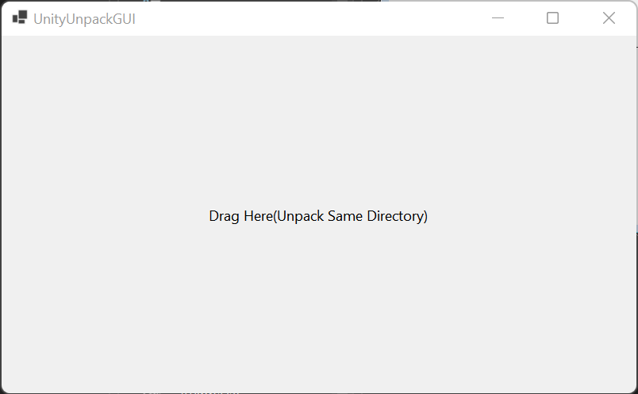

# NF.Tool.UnityPackage

<a href="https://github.com/netpyoung/NF.Tool.UnityPackage/actions">
  
</a>


## example

``` cmd
> NF.Tool.UnityPackage.Console.exe pack -i sample -o sample.unitypackage
> NF.Tool.UnityPackage.Console.exe unpack -i sample.unitypackage
```

## develop

``` cmd
> cd src
> dotnet test
> cd NF.Tool.UnityPackage.Console
> dotnet publish -c Release -r win10-x64 -p:PublishSingleFile=true -p:PublishTrimmed=true -p:TrimUnusedDependencies=true
> 7z a -tzip release.zip %CD%/bin/Release/netcoreapp3.1/win10-x64/publish/NF.Tool.UnityPackage.Console.exe
```

## GUI



## Ref

- <https://github.com/TwoTenPvP/UnityPackager>
- <https://github.com/MirrorNG/unity-packer>
- <https://github.com/ogxd/unity-packer>
- <https://github.com/marketplace/actions/create-unitypackage>
- <https://github.com/Cobertos/unitypackage_extractor>